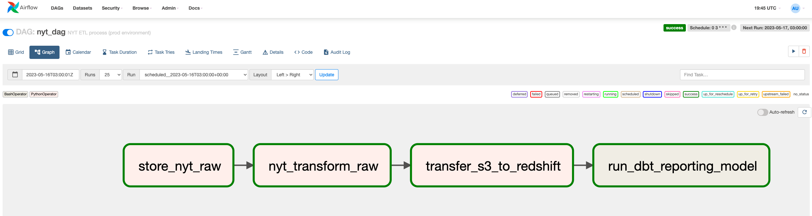

# New York Times ETL with Airflow, S3, and Redshift

A full end-to-end analytics pipeline using modern cloud technologies.  
I use Python, dbt, Airflow, and AWS services such as Redshift, EC2 and VPCS as well as Tableau Desktop as the BI-tool.  

- Project demonstrates a practical ETL pipeline to extract daily article data from the New York Times API
- It performs transformations using Python, and stores the data in two S3 buckets.
- The data is then loaded into Redshift, and a dbt model creates a reporting view for analysis.
- The pipeline is orchestrated using Airflow, running on an Ubuntu EC2 instance.
- The solution follows best practices for Data Engineering and supports both production and QA environments with separate S3 buckets and Redshift databases.

## Key Components

1. **New York Times API**: Sourcing the most popular articles on a given day.
2. **Amazon S3**: Storage for the raw JSON data and transformed CSV files. Separate buckets are used for prod and qa environments.
3. **Apache Airflow**: Orchestration of the ETL pipeline, running on an Ubuntu EC2 instance (t2.medium).
4. **Amazon Redshift**: Destination data warehouse for storing the processed data. Separate databases are used for prod and qa environments.
5. **Amazon Athena**: Querying platform to analyze the stored data.
6. **dbt**: To create incremental reporting views in Redshift.
7. **Tableau Desktop**: To visualise the the top articles by type, authors and words. Leveraging Tableau table extensions to do some further NLP analysis based off reporting views.

## ETL Workflow

1. Call the New York Times API and fetch the most popular articles.
2. Store the raw JSON response in the `raw/` folder of an S3 bucket, using separate buckets for prod and qa environments.
3. Perform basic transformations on the raw data using Python:
    - Extract relevant fields such as title, abstract, published_date, section, and URL.
4. Save the transformed data as a CSV file in the `processed/` folder of the S3 bucket.
5. Use the Redshift COPY command to load the CSV data from the S3 bucket into a Redshift table, using separate databases for prod and qa environments.
6. Query the source table in Amazon Athena to analyze the top articles data.

The ETL pipeline is scheduled to run daily at 3am UTC using Apache Airflow.

## Environment Handling

The pipeline handles different environments by using Airflow variables to switch between prod and qa environments. This includes separate S3 buckets for raw and processed data, as well as separate Redshift databases for each environment.

## Getting Started

1. Set up an AWS account with access to S3, Redshift, and Athena services.
2. Create an EC2 instance (t2.medium) running Ubuntu and install Apache Airflow.
3. Create a New York Times Developer account and obtain an API key.
4. Set up the necessary Airflow connections and variables (e.g., AWS credentials, Redshift connection, S3 bucket names for prod and qa, New York Times API key, etc.).
5. Deploy the DAG code to the Airflow instance and enable the DAG in the Airflow UI.

